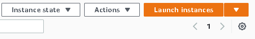
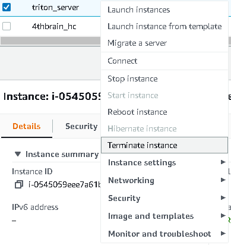

<p align = "center" draggable=”false” >
</p>


# <h1 align="center" id="heading">Phase VII - Sentiment Analysis using Nvidia Triton on EC2</h1>


## ☑️ Objectives
At the end of this session, you will have a brief understanding of how to:
- [ ] Trace an ML model with torchscript
- [ ] Create a model repository
- [ ] Deploy the models in the repository using Nvidia Triton server


## Tasks
There's only one tasks for this session.
1. Complete the directions in this README

## How to Submit GitHub Exercise
- Submit a link to your endpoint link on canvas (this link should be unique to your project).

## Background
Please review the weekly narrative [here](https://www.notion.so/Week-4)


# Nvidia Triton Server

This project contains the source code and supporting files to deploy a triton inference server on an AWS EC2 instance. It includes the following files and folders.

- TorchscriptTracing.ipynb - Notebook to trace a huggingface model into a format compatible with triton server
- inference.py - Code to perform requests to the triton server
- requirements.txt - A list of the required libraries to install

The application uses several AWS resources, including EC2 instances functions and an S3 bucket for the model repository. 

<details>
     <summary><b>Before we Get Started</b></summary>    
     
     
## I. Dependencies

To complete the assignment you need to feel confortable using ssh to remotely access an AWS EC2 instance. Docker must be installed on the instance.

### I.1 AWS account creation

Follow the next tutorial to create and verify an AWS account

<https://aws.amazon.com/premiumsupport/knowledge-center/create-and-activate-aws-account/>

### I.2 Docker installation

Use the convenience script to install docker on linux. For more

```bash
 curl -fsSL <https://get.docker.com> -o get-docker.sh
 DRY_RUN=1 sh ./get-docker.sh
```

Verify that your user can run docker commandas ccan run Docker commands without using sudo.by
running by running the following command:

```bash
  docker ps

 CONTAINER ID        IMAGE               COMMAND             CREATED             STATUS              PORTS               NAMES

```

### I.3 Install the requirements locally to trace the model and run the inference

Install the required libraries using pip

```bash
teslabot$ pip install -r requirements.txt
```
 
</details>


<details>
     <summary><b>Run the jupyter notebook to get the torchscript model</b></summary>


## II. Use the TorchscriptTracing notebook to create a compatible model

To create a model compatible with Nvidia Triton server, you must run inference once with the jit compiler


You should see a model.pt created and you need to create a config.pbtxt that contains the input and output tensor shapes:

```bash
name: "distilbert"
platform: "pytorch_libtorch"
input [
 {
    name: "input__0"
    data_type: TYPE_INT32
    dims: [1, 256]
 }
]
output {
    name: "output__0"
    data_type: TYPE_FP32
    dims: [1, 2]
  }

```

In this case, the input tensors are tokenised sentences 256 words long and the outputs are the logits for the negative/positive classes.

</details>

     
     
     


<details>
     <summary><b>Deploy on AWS</b></summary>

## III. Deploy on AWS

### III.1 Create an S3 model repository and launch an EC2 Instance

1. Make sure that you have an active AWS account

2. Select us-east-1 as the aws region for the remaining steps of the assignment.
  

3. Go to [S3 storage](https://s3.console.aws.amazon.com/s3/home?region=us-west-1)
create a new bucket clicking "Create Bucket"

4. Upload the traced model with the following folder structure:
```bash
    models
    └───distilbert
        └───config.pbtxt
        └───1
            └───model.pt
```


5. Go to [EC2 instances](https://us-west-1.console.aws.amazon.com/ec2/v2/home?region=us-west-1#Home:)
launch a new instance clicking "Launch Instance"


6. SSH into the EC2 instance
```bash
teslabot$ ssh ec2-user@ec2.public.ipv4.address
```

### III.2 Deploying with Nvidia Triton server

Create a env file with aws credentials:

    AWS_ACCESS_KEY_ID=SOME_ACCESS_KEY
    AWS_SECRET_ACCESS_KEY=SOME_SECRET_ACCESS_KEY
    AWS_DEFAULT_REGION=us-east-1

To run the inference server on GPU: 

```bash
teslabot$ docker run --gpus=1 -p8000:8000 -p8001:8001 -p8002:8002 --env-file .envs3 -p8000:8000 -p8001:8001 -p8002:8002 --rm --net=host nvcr.io/nvidia/tritonserver:22.06-py3 tritonserver --model-repository=s3://triton-repository/models/
```

To run the inference server on CPU: 

```bash
teslabot$ docker run -p8000:8000 -p8001:8001 -p8002:8002 --env-file .envs3 -p8000:8000 -p8001:8001 -p8002:8002 --rm --net=host nvcr.io/nvidia/tritonserver:22.06-py3 tritonserver --model-repository=s3://triton-repository/models/
```


### III.3 Testing the API endpoint

Run the inference client with the correct ip address

```bash
teslabot$ python3 inference.py
```

</details>


### Cleanup

To delete the sample application that you created, just terminate the EC2 instance by right clicking it and selecting "Terminate Instance":




### Resources

See the [PyTorch Torchscript Documentation](https://pytorch.org/docs/stable/jit.html) for more details on torchscript

See the [Nvidia Triton Documentation](https://docs.nvidia.com/deeplearning/triton-inference-server/user-guide/index.html) for more details on the deployment